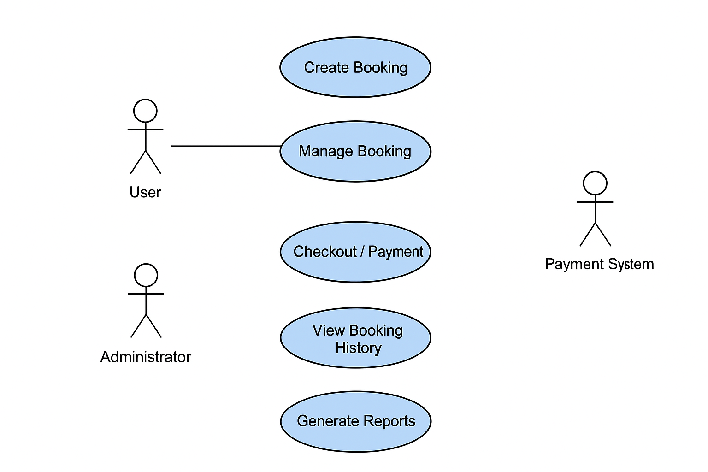

# Requirement Analysis in Software Development

## Introduction
This repository serves as a guide and reference for understanding requirement analysis in software development. 
It covers the techniques, processes, and best practices involved in gathering, analyzing, and documenting software requirements to ensure successful project outcomes.

## What is Requirement Analysis?
Requirement Analysis is the process of identifying, documenting, and managing the needs and expectations of stakeholders for a software system. It is a critical phase in the Software Development Life Cycle (SDLC) that ensures the final product meets the intended objectives and user requirements.

**Importance in SDLC:**
- Prevents Miscommunication
- Reduces Development Costs
- Enhances Product Quality
- Facilitates Project Planning
- Supports Maintenance and Scalability

## Why is Requirement Analysis Important?
Requirement Analysis is critical in the SDLC because it lays the foundation for a successful software project. Key reasons include:
- **Ensures Stakeholder Alignment:** All stakeholders have a common understanding of software objectives.
- **Reduces Risk and Costs:** Early detection of issues prevents expensive fixes later.
- **Improves Software Quality:** Clear requirements enable accurate design and implementation.

## Key Activities in Requirement Analysis
The following are the main activities involved in requirement analysis:

- **Requirement Gathering:** Collecting information about software needs from stakeholders.
- **Requirement Elicitation:** Engaging stakeholders to uncover hidden or implicit requirements.
- **Requirement Documentation:** Recording all gathered requirements clearly and accessibly.
- **Requirement Analysis and Modeling:** Identifying conflicts, gaps, and creating models like flowcharts or use case diagrams.
- **Requirement Validation:** Ensuring requirements accurately reflect stakeholder needs and are feasible.

## Types of Requirements

### Functional Requirements
**Definition:**  
Functional requirements describe what the system should do, outlining the specific behaviors, functions, and operations the software must perform.

**Examples for a Booking Management System:**
- Users can create and manage bookings.
- The system sends confirmation emails after successful bookings.
- Administrators can view and modify booking schedules.
- The system generates booking reports on demand.

### Non-functional Requirements
**Definition:**  
Non-functional requirements specify how the system performs its functions, focusing on system qualities such as performance, usability, security, and reliability.

**Examples for a Booking Management System:**
- The system should load booking pages within 3 seconds.
- Data must be encrypted to ensure user privacy.
- The system must be available 99.9% of the time.
- The interface should be intuitive and easy to navigate for users.

  ## Use Case Diagrams
**Definition:**  
Use Case Diagrams are visual representations of the interactions between users (actors) and a system. They help illustrate the functional requirements of a system by showing which actions users can perform and how the system responds.

**Benefits:**
- Provide a clear overview of system functionality.
- Help communicate requirements to stakeholders and developers.
- Identify missing or redundant features during requirement analysis.
- Support documentation for system design and testing.

**Example for Booking Management System:**  
Below is a use case diagram illustrating the main actors and use cases of a booking system.  

  

**Actors:**
- User
- Administrator
- Payment System

**Use Cases:**
- Create Booking
- Manage Booking
- Checkout / Payment
- View Booking History
- Generate Reports

## Acceptance Criteria
**Definition and Importance:**  
Acceptance criteria are a set of conditions that a software product must satisfy to be accepted by a stakeholder or client. They provide clear, measurable requirements that define whether a feature works as intended. In Requirement Analysis, acceptance criteria are important because they:

- Ensure that developers and stakeholders share the same understanding of a feature.
- Help QA teams create test cases to verify functionality.
- Reduce misunderstandings and rework by providing clear expectations.

**Example for Checkout Feature in Booking Management System:**
- Users can add bookings to a cart and proceed to checkout.
- Users can select a payment method and successfully complete the payment.
- The system sends a confirmation email after payment is processed.
- The booking is immediately reflected in the user's booking history.
- The checkout process must be completed within 2 minutes to ensure a smooth user experience.

